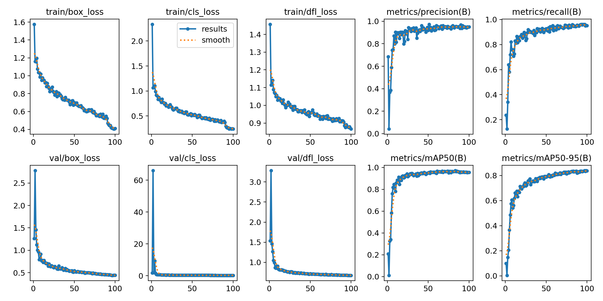
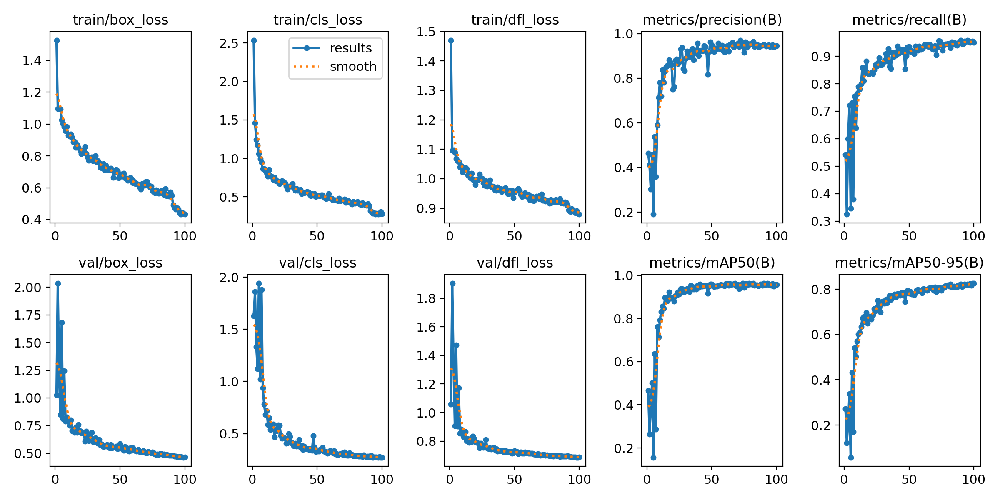
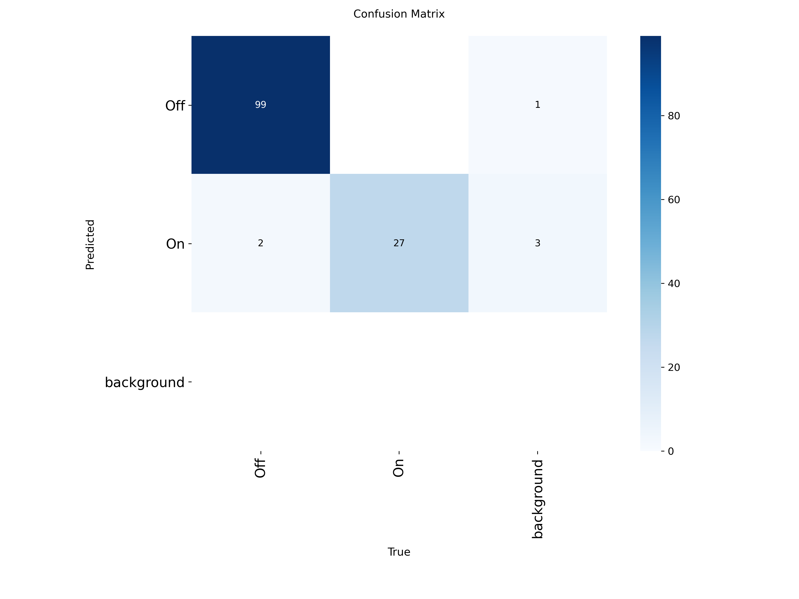
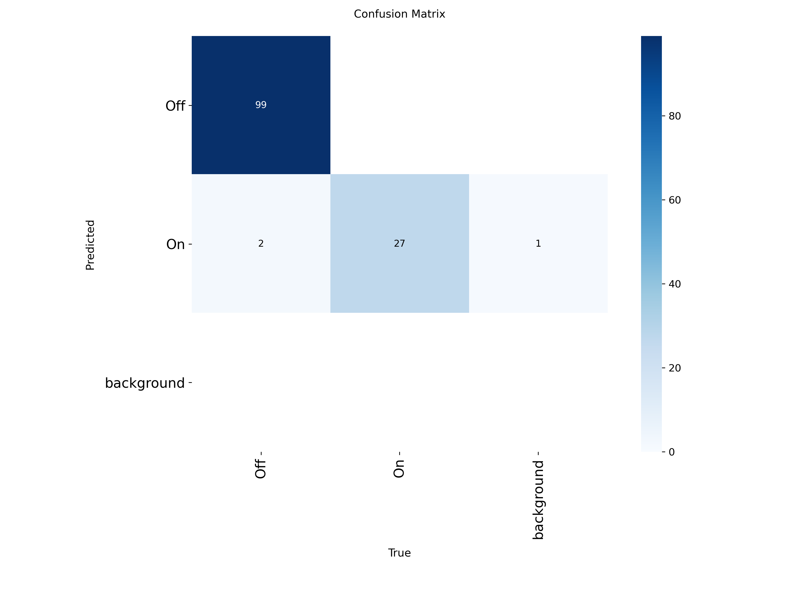

# Real-Time Vehicle Turn Signal Detection via YOLOv11

**Final Year Project (FYP) — Department of Electronic Engineering, The Chinese University of Hong Kong (CUHK)**

> *A high-performance, domain-adaptive vehicle turn signal detection system for autonomous driving on Taiwan highways, leveraging YOLOv11 with Real-ESRGAN super-resolution preprocessing.*

---

## Table of Contents

1. [Introduction](#introduction)
2. [Performance Highlights](#performance-highlights)
3. [Repository Structure](#repository-structure)
4. [Environment Setup](#environment-setup)
5. [Data Preparation](#data-preparation)
6. [Model Training](#model-training)
7. [Benchmarking](#benchmarking)
8. [Visualization](#visualization)
9. [Acknowledgements](#acknowledgements)
10. [License](#license)

---

## Introduction

The rapid advancement of autonomous driving systems has elevated vehicle perception beyond basic obstacle detection to the domain of **behavioural intent recognition**. On high-speed highway networks — such as those in Taiwan, where vehicles routinely exceed 100 km/h — accurate real-time detection of surrounding vehicles' turn signal states (*on* / *off*) provides critical lead time for lane-change prediction and collision avoidance.

This project presents a **YOLOv11s-based binary turn signal detection system** specifically engineered for Taiwan highway surveillance footage. It constitutes the second phase of a two-part Final Year Project, building upon the Faster R-CNN modular pipeline established in Thesis I.

### Core Contributions

- **Domain-adaptive dataset construction**: 7,856 manually annotated frames extracted from private Taiwan highway dashboard-camera recordings, addressing the severe domain gap (mAP@50 = 0.309) observed with public datasets such as ATLAS.
- **Preprocessing pipeline**: An automated **vehicle-centric cropping** strategy using a pre-trained YOLOv8m detector (with 20% bounding box expansion) followed by **2× Real-ESRGAN super-resolution** upscaling to recover fine-grained textures of small-scale turn signal lamps.
- **State-of-the-art architecture**: Adoption of **YOLOv11s** with its C3k2 backbone blocks and C2PSA spatial attention modules, enabling superior localization of small objects occupying less than 1% of the image area.
- **Rigorous comparative evaluation**: Direct, same-dataset comparison against YOLOv8s trained under identical hyperparameter conditions.

---

## Performance Highlights

### YOLOv11s — Final Model Performance (Taiwan Highway Dataset)

| Metric | Value | Interpretation |
|---|---|---|
| **Precision** | 0.942 | Low false-positive rate; highly reliable detections |
| **Recall** | 0.961 | High detection rate; minimal missed signals |
| **mAP@0.50** | **0.958** | Superior overall accuracy at IoU threshold 0.5 |
| **mAP@0.50:0.95** | 0.839 | Precise bounding-box localization across multiple IoU thresholds |
| **Inference Latency** | **7.25 ms** | Measured on NVIDIA 2080Ti GPU (FP16, 640×640) |
| **Throughput** | 138 FPS | Exceeds real-time requirement for autonomous driving |

### YOLOv11s vs. YOLOv8s — Direct Comparative Summary

| Model | Precision | Recall | mAP@0.50 | mAP@0.50:0.95 | Latency (ms) | FPS |
|---|---|---|---|---|---|---|
| YOLOv8s *(baseline)* | 0.945 | 0.952 | 0.957 | 0.826 | 6.1 | 164 |
| **YOLOv11s** *(proposed)* | **0.942** | **0.961** | **0.958** | **0.839** | 7.25 | 138 |

> YOLOv11s achieves a superior mAP@0.50:0.95 (+0.013) — indicating improved bounding-box localization for small turn signals — at an acceptable latency trade-off attributable to the C2PSA spatial attention mechanism.

### Historical Baseline Comparison

| Model | Dataset | Task | mAP@0.50 | Speed (FPS) |
|---|---|---|---|---|
| Faster R-CNN | MNIST (Synthetic) | Digit Detection | 0.82 | ~12 |
| YOLOv8 | ATLAS (Public) | Multi-class Road | 0.309 | ~80 |
| **YOLOv11s** | **Taiwan Highway (Custom)** | **Binary (On/Off)** | **0.958** | **138** |

---

## Repository Structure

```
.
├── data/
│   └── data.yaml                              # Dataset configuration (class names, train/val/test paths)
│
├── results/
│   ├── v11_run/                               # All training artifacts for YOLOv11s
│   │   ├── args.yaml                          # Full training configuration (auto-generated by Ultralytics)
│   │   ├── results.csv                        # Per-epoch metrics (loss, mAP, precision, recall)
│   │   ├── results.png                        # Training curves (loss, mAP, precision, recall)
│   │   ├── confusion_matrix.png               # Confusion matrix (raw counts)
│   │   ├── confusion_matrix_normalized.png    # Confusion matrix (normalized, for academic reference)
│   │   ├── BoxF1_curve.png                    # F1-score vs. confidence threshold curve
│   │   ├── BoxP_curve.png                     # Precision vs. confidence curve
│   │   ├── BoxR_curve.png                     # Recall vs. confidence curve
│   │   ├── BoxPR_curve.png                    # Precision-Recall curve
│   │   ├── train_yolov11.log                  # Full training log (console output)
│   │   ├── val_batch0_labels.jpg              # Ground truth annotations for validation batch 0
│   │   └── val_batch0_pred.jpg                # Model predictions for validation batch 0
│   │
│   └── v8_run/                                # All training artifacts for YOLOv8s (baseline)
│       ├── args.yaml
│       ├── results.csv
│       ├── results.png
│       ├── confusion_matrix.png
│       ├── confusion_matrix_normalized.png
│       ├── BoxF1_curve.png
│       ├── BoxP_curve.png                     
│       ├── BoxR_curve.png 
│       ├── BoxPR_curve.png
│       ├── train_yolov8.log
│       ├── val_batch0_labels.jpg              
│       └── val_batch0_pred.jpg   
│
├── src/
│   ├── train_yolov11.py                       # Training script for YOLOv11s
│   ├── train_yolov8.py                        # Training script for YOLOv8s
│   ├── split_data.py                          # Dataset splitting script (80:10:10 video-level split)
│   ├── extract_time_data_v11.py               # Inference latency & FPS benchmarking for YOLOv11s
│   └── extract_time_data_v8.py                # Inference latency & FPS benchmarking for YOLOv8s
│
├── weights/
│   ├── yolov11s_best.pt                       # Best YOLOv11s checkpoint (selected by validation mAP@0.50)
│   └── yolov8s_best.pt                        # Best YOLOv8s checkpoint (baseline)
│
├── requirements.txt                           # Python dependencies
└── README.md
```

---

## Environment Setup

### Hardware

| Component | Specification |
|---|---|
| GPU | NVIDIA GeForce RTX 2080Ti (11 GB GDDR6) |
| OS | Ubuntu 24.04.2 LTS |
| CUDA | 11.8 |
| cuDNN | 9.1.0 |

### Software Dependencies

```bash
# Python environment
Python        3.13.12
PyTorch       2.7.1
Ultralytics   8.4.33   # YOLOv11 framework
OpenCV        4.13.0.92
```

Install all dependencies via:

```bash
pip install ultralytics opencv-python tensorboard matplotlib
```

> **Note:** The Ultralytics package provides both the YOLOv11 and YOLOv8 frameworks. Ensure CUDA drivers are correctly configured prior to training.

---

## Data Preparation

### Dataset Overview

The custom dataset comprises **7,856 annotated frames** extracted from private Taiwan highway dashboard-camera recordings provided by Ms. Ho, Ting-Syuan. Footage was captured at 30 FPS under diverse real-world conditions including daytime, nighttime, tunnel lighting, and light rain.

**Binary class definitions:**
- `on` — Signal lamp actively flashing or steadily illuminated
- `off` — Signal lamp not illuminated

**Dataset splits (partitioned at the video level to prevent data leakage):**

| Split | Images |
|---|---|
| Training | 6,284 |
| Validation | 785 |
| Test | 787 |

### Dataset Configuration

Update `data/data.yaml` with the correct absolute or relative paths to your dataset:

```yaml
# data/data.yaml
path: /path/to/your/dataset
train: images/train
val: images/val
test: images/test

nc: 2
names: ['Off', 'On']
```

---

## Model Training

Models are trained via `src/train_yolov11.py` and `src/train_yolov8.py`. The only difference are the model used to train. Key hyperparameters were kept **identical** across YOLOv11s and YOLOv8s to ensure fair comparison.

### Key Hyperparameters

| Parameter | Value | Rationale |
|---|---|---|
| Input Resolution | 640 × 640 | Balanced speed–accuracy for small-object detection |
| Epochs | 100 | Full training duration; no early stopping triggered |
| Batch Size | 16 | Adjusted for 11 GB GPU memory |
| Optimizer | SGD | Standard for YOLO training |
| Initial LR | 1.6 × 10⁻³ | Linear decay scheduler applied after warmup |
| Warmup Epochs | 3 | Stabilizes gradient flow in early training |
| Close Mosaic | 10 | Mosaic active for epochs 1–90; disabled for fine-tuning in epochs 91–100 |
| Mixed Precision | AMP (FP16) | Accelerates training and reduces GPU memory usage |
| Weight Decay | 5 × 10⁻⁴ | Standard regularization to prevent overfitting |

### Training Commands

**Train YOLOv11s (proposed model):**

```bash
python src/train_yolov11.py \
    --model   yolo11s.pt \
    --data    data/data.yaml \
    --epochs  100 \
    --batch   16 \
    --imgsz   640 \
    --project results \
    --name    v11_run
```

**Train YOLOv8s (baseline):**

```bash
python src/train_yolov8.py \
    --model   yolov8s.pt \
    --data    data/data.yaml \
    --epochs  100 \
    --batch   16 \
    --imgsz   640 \
    --project results \
    --name    v8_run
```

> Trained weight checkpoints are saved to `weights/yolov11s_best.pt` and `weights/yolov8s_best.pt` respectively.

### Validation

```bash
# Validate YOLOv11s
yolo val model=weights/yolov11s_best.pt data=data/data.yaml imgsz=640

# Validate YOLOv8s
yolo val model=weights/yolov8s_best.pt  data=data/data.yaml imgsz=640
```

---

## Benchmarking

Inference latency and throughput (FPS) are evaluated using dedicated benchmarking scripts that perform warmup runs and average measurements across the entire test set.

### YOLOv11s Benchmarking

```bash
python src/extract_time_data_v11.py \
    --weights weights/yolov11s_best.pt \
    --data    data/data.yaml \
    --imgsz   640 \
    --device  0
```

### YOLOv8s Benchmarking

```bash
python src/extract_time_data_v8.py \
    --weights weights/yolov8s_best.pt \
    --data    data/data.yaml \
    --imgsz   640 \
    --device  0
```

Both scripts report **average per-image inference latency (ms)**, **post-processing time**, and **overall FPS** to stdout. Measurements were conducted on an NVIDIA 2080Ti GPU with FP16 precision enabled.

---

## Visualization

### Training Curves

Training loss curves (Box Loss, Classification Loss, Distribution Focal Loss), together with validation Precision, Recall, mAP@0.50, and mAP@0.50:0.95 are exported automatically after training.

**YOLOv11s training curves:**



**YOLOv8s training curves:**



### Confusion Matrices

**YOLOv11s confusion matrix:**



**YOLOv8s confusion matrix:**



### TensorBoard Monitoring

Training metrics can be monitored in real time via TensorBoard:

```bash
tensorboard --logdir results/
```

---

## Acknowledgements

This project was conducted as a Final Year Project (FYP) in the **Department of Electronic Engineering, The Chinese University of Hong Kong (CUHK)**, under the academic year 2025–2026.

The author expresses sincere gratitude to the following individuals for their indispensable contributions:

- **Professor Li Hongsheng** — Project supervisor. His expertise in deep learning and computer vision provided the foundational guidance that shaped the entire research direction, from the Faster R-CNN pipeline in Thesis I through to the final YOLOv11-based system.

- **Ms. Ho, Ting-Syuan, and her research team** — For generously providing the high-quality, privately collected Taiwan highway dashboard-camera dataset. The custom annotations derived from this data were critical to overcoming the domain gap observed with public datasets and achieving strong real-world detection performance.


- **Dr. Ju Xiaoliang** — For his technical recommendations on object detection algorithms and for providing access to the departmental NVIDIA 2080Ti GPU server, which was essential for model training and evaluation.

- **Mr. Manson Mak and the technical support team** of the Department of Electronic Engineering — For their assistance with administrative and laboratory matters.

---

## Dataset Availability

| Item | Status |
|---|---|
| Custom Taiwan Highway Dataset (7,856 images) | 🏗️ Uploading to [Google Drive](#) |
| Annotations (YOLO format `.txt`) | 🏗️ Uploading to [Google Drive](#) |
| Pre-trained Weights (`yolov11s_best.pt`, `yolov8s_best.pt`) | 🏗️ Uploading to [Google Drive](#) |

> **Note:** The dataset was collected under a private agreement. Once uploaded, the Google Drive link will be updated here. For access enquiries in the interim, please contact 1155192095@link.cuhk.edu.hk.

---

## AI Tools Disclosure

In the preparation of this repository documentation(README), AI-assisted writing tools — including **Claude (Anthropic)** — were employed to support drafting and linguistic refinement. All AI-generated content was critically reviewed and verified by the author against the original experimental data and thesis findings. The core research methodology, dataset construction, and technical contributions remain the original work of the author.

---

## License

This repository is intended for academic and research purposes only. The dataset used in this project was provided under a private agreement and is **not publicly distributed**. Please contact the Department of Electronic Engineering, CUHK, for further enquiries regarding data access.

---

*Department of Electronic Engineering, The Chinese University of Hong Kong*
*Final Year Project — April 2026*
